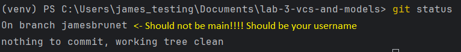

# intro-to-git-branches

In this lab, you will edit some python and commit your changes using the git CLI.

## Step 1 - Install and Run Application

These instructions will get you a copy of the project up and running on your local machine for development and testing purposes.

### Prerequisites

What things you need to install the software and how to install them:

- Python 3.x
- Flask

You can install Flask using pip:

```bash
pip install Flask
```

### Installing and Running

1. Clone the repository to your local machine using `git clone https://github.com/Carleton-BIT/workshop-git-IMD2900.git`
2. Navigate to the cloned directory.
3. Run the Flask application:

```bash
python main.py
```

This will start a local server on `http://127.0.0.1:5000/`. Navigate to this URL in your web browser to view the application.

## Step 2 - Making Commits

1) Run this command to ensure you are using the Nano text editor: `git config --global core.editor "nano" `

2) Create and switch to a new branch which is named after your mycarletonone username, in all lower case. For example, `jamesbrunet3`. You should create this branch in your local repository, not using the GitHub web interface, by running the command `git checkout -b jamesbrunet3` (instead of jamesbrunet3, put in your mycarletonone username)

3) Verify you are on the correct branch by running `git status`:


4) Look at main.py: Comments are stored in a list called "comments". Edit the comment from "jimmy" to say "Bananas are awesome, thanks for sharing.", and verify that the updated comment is visible in the application (you may need to restart the flask application by using ctrl-c and running `python main.py` again)

5) Stage your change for commit using `git add .`

6) Commit the changes with a descriptive commit message. E.G. `git commit -m "perform censorship"`

7) Push your changes to your branch using `git push origin <your_branch_name>`

8) Make a change of your choice to this README, commit this change to your branch with a descriptive message, and push your change to GitHub

## Step 3 - Pull Requests

1) On the GitHub website, create a pull request for your branch that describes your change to the README and why you want to make it. If merged, this pull request should make changes to the main branch. Some relevant docs: [Creating a pull request - GitHub Docs](https://docs.github.com/en/pull-requests/collaborating-with-pull-requests/proposing-changes-to-your-work-with-pull-requests/creating-a-pull-request#creating-the-pull-request)

2) Look through the list of pull requests created by other students. Comment and react on two other pull requests (try to prioritize people who haven't gotten any comments yet), and review the changes other students made to their READMEs

3) Going back to the project open on your computer, make one more change to the readme, commit the change, and push the change. You'll see that your pull request has been updated with the new commit.

**Before moving on to the next step, I need to set some things set up. If you get to this point, raise your hand to check if we've done that.**

## Step 4 - Merge Conflict

Review your pull request - you should have a MERGE CONFLICT identified in your pull request that prevents your branch from being merged! This is because I made changes to the main branch during this lab. Here's a visual description of what's going on and how we can deal with it:


Resolve this merge conflict by:

- Ensure your main branch is up to date `git pull origin main`
- Merge your main branch into your branch. While you have the feature branch (e.g. jamesbrunet) checked out, run `git merge main`
- Resolve the merge conflict by viewing main.py and trying to incorporate the changes made in both branches into a single commit
- When done, you can git commit your resolution and git push your feature branch
- Then, you can view your pull request again - there should no longer be a merge conflict.

## About

A simple Flask application serving as a blog dedicated to discussing the merits of bananas and other fruits. This application allows users to read about the benefits of bananas and participate in the discussion by leaving comments. Currently, the functionality to leave comments does not work.

## Features (not all finished yet)

- Display an article on why bananas are the best fruit.
- Show a list of user comments on the article.
- A form to submit new comments.

## Structure

- `main.py`: The main Python script running the Flask application.
- `templates/`: Directory containing the HTML templates.
- `static/`: Directory containing static files like CSS and images.

## Contributing

Please feel free to fork this repository and contribute by submitting a pull request.

## License

This project is licensed under the Poblic License - see the [LICENSE.md](LICENSE.md) file for details.
